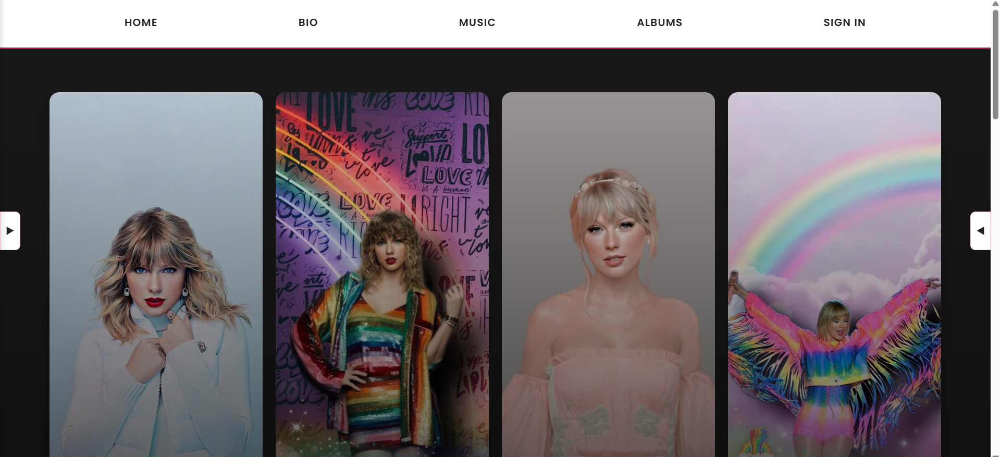
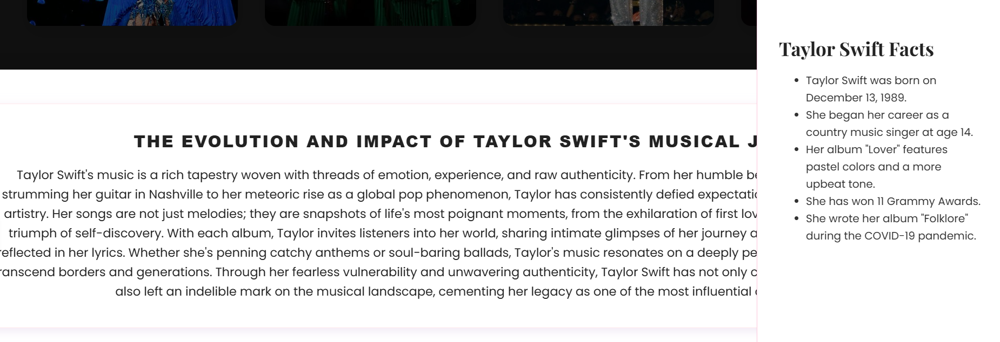
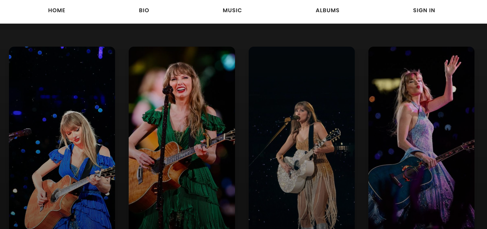

# Taylor Swift Fan Website

A tribute website dedicated to Taylor Swift, featuring her biography, music, albums, and more. This project was created using HTML, CSS, and JavaScript with a pastel color scheme inspired by Taylor Swift's 'Lover' album.

## Features

- **Home Page**: Introduction to Taylor Swift with featured images
- **Biography**: Detailed information about Taylor Swift's life and career
- **Music**: Information about Taylor Swift's musical journey and discography
- **Albums**: Gallery of Taylor Swift's album covers with links to listen
- **Sign In/Login**: User authentication pages

## Screenshots

### Home Page

### Biography

### Music

### Albums

## How to Add Screenshots

1. Take screenshots of each page of the website
2. Save them in the `screenshots` folder with the following names:
   - `home.png` - Screenshot of the home page
   - `bio.png` - Screenshot of the biography page
   - `music.png` - Screenshot of the music page
   - `albums.png` - Screenshot of the albums page
3. Push the screenshots to GitHub

## How to Run

1. Clone this repository
2. Open `swiftie.html` in your web browser
3. Navigate through the website using the navigation menu

## Technologies Used

- HTML5
- CSS3
- JavaScript
- Google Fonts
- Responsive Design

## Contributors

- Anuva
- Radhe
